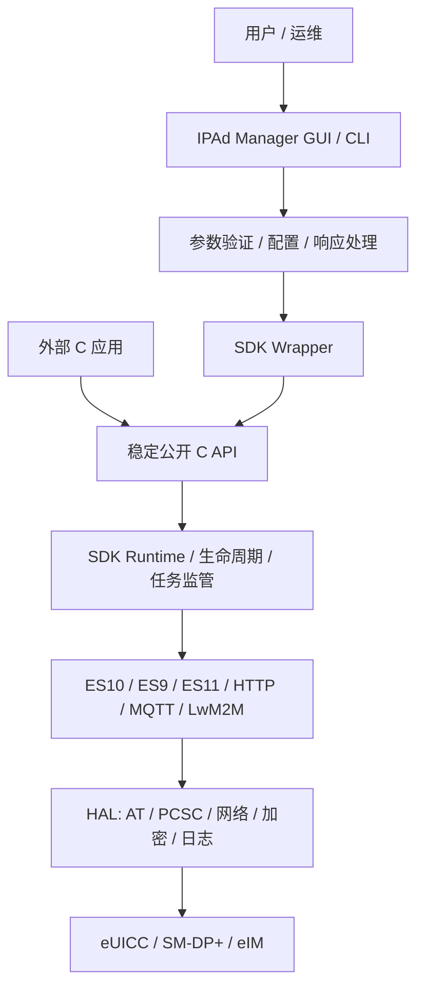

# IPAd SDK 与 IPAd Manager

[](https://github.com/Scott202605/ipa-application/actions/workflows/ubuntu-build.yml)


IPAd SDK 是面向 Linux 的 GSMA SGP.32 IoT Profile Assistant 实现；IPAd Manager 1.1.0 在 SDK 之上提供 GTK3 图形入口、配置管理、健康检查、脱敏诊断，以及 Ubuntu 与 Windows 的统一安装体验。

本仓库同时包含 SDK 源码、Manager、自动化测试和安装包构建链。安装成功表示软件及本机依赖就绪；真实 eUICC、SM-DP+、eIM、凭据和网络环境仍需在项目现场验收。

## 当前交付内容

- IPAd SDK：SGP.32、eUICC 信息查询、通知、Fallback、Emergency Profile，以及 HTTP、MQTT、LwM2M 通信入口。
- IPAd Manager：GTK3 GUI、参数验证、配置加载、SDK Wrapper、日志和无图形环境 CLI 检查。
- 产品化运行：SDK 生命周期保护、任务监管、配置快照、诊断与故障注入测试、ABI/布局检查和发布门禁。
- Ubuntu 安装包：Manager、私有 `libipa.so`、默认配置、桌面入口、健康检查和脱敏诊断工具。
- Windows 安装器：在 WSL2 的 `Ubuntu` 发行版中安装同一 canonical DEB，并创建 Windows 启动入口。
- 可校验发布：构建元数据、依赖锁定、安装清单、健康报告和 SHA-256 校验文件。

## 快速开始

### Ubuntu

支持 Ubuntu x86-64。图形运行需要 Linux 桌面会话；WSL 中需要 WSLg。

```bash
sudo apt install ./ipad-manager_<version>_amd64.deb
ipad-manager-health --json
ipad-manager-launch
```

安装后：

- 主程序：`/usr/bin/ipad-manager`
- 默认配置：`/etc/ipad-manager/config.json`
- 私有 SDK：`/usr/lib/ipad-manager/libipa.so`
- 产品元数据：`/usr/share/ipad-manager/`

包内已配置运行时库路径，正常安装后无需设置 `LD_LIBRARY_PATH`。升级不会静默覆盖用户配置。

详细步骤见 [Ubuntu 安装与维护](docs/installation/Ubuntu.md)。

### Windows

Windows x64 使用 `IPAd-Manager-Setup-<version>-x64.exe`。安装器会检测或补齐 WSL2、名为 `Ubuntu` 的发行版及 Linux 依赖，然后显式通过 `Ubuntu/root` 安装内置 DEB 并运行健康检查。

运行 GUI 还需要 WSLg。安装器和卸载器不会注销、覆盖或删除现有 WSL 发行版；卸载默认保留 Ubuntu 中的用户配置。

详细步骤和日志位置见 [Windows 安装与维护](docs/installation/Windows.md)。

### 健康检查与诊断

```bash
ipad-manager-health --json
ipad-manager-diagnostics ~/ipad-manager-diagnostics.tar.gz
```

诊断导出会脱敏密码、令牌、激活码、确认码和密钥字段。安装成功不代表外部硬件或远端服务已经可用；健康检查会将本机软件状态与环境依赖分开报告。

## SDK 与 Manager 如何协同



外部 C 程序直接依赖 `ipa_sdk_pc/include/` 中的公开头文件和 `libipa.so`。Manager 则通过以下分层隔离界面、配置和 SDK 实现：

1. GUI / CLI：用户交互、参数输入、状态和日志展示。
2. 业务逻辑：参数验证、命令组织、配置与响应处理。
3. SDK Wrapper：生命周期、错误码、回调和内存所有权适配。
4. IPAd SDK：SGP.32 业务、eSIPa 协议、eUICC 通信与平台抽象。

因此，SDK 内部优化可以保持公开 C API 和 ABI 不变，Manager 与外部集成代码无需跟随内部实现重写。发布门禁会覆盖公开布局、生命周期、故障路径和安装产物。

## 能力矩阵

| 能力 | 状态 | 说明 |
|---|---|---|
| SDK 初始化/反初始化 | **Available** | 无硬件 smoke test 与发布门禁覆盖 |
| 信息查询入口 | **Environment-dependent** | 接口、ABI 与调用链已具备；真实结果依赖 eUICC |
| 通知处理 | **Available** | SDK 回归测试覆盖 |
| Fallback / Emergency Profile | **Environment-dependent** | 完整结果依赖真实 Profile 环境 |
| HTTP / MQTT / LwM2M | **Environment-dependent** | TLS/DTLS 和入口已具备；结果依赖远端服务 |
| PC/SC / AT 设备访问 | **Environment-dependent** | 依赖、编译选项与配置可探测；设备操作需硬件验收 |
| Manager Profile 下载/启用/禁用/删除 | **Not implemented** | 当前 Wrapper 明确返回 `eNotImpl` |

完整验收边界见 [IPAd Manager 与 SDK 能力矩阵](docs/installation/Capability_Matrix.md)。状态含义：

- **Available**：仓库已实现，并有相应自动化验证。
- **Environment-dependent**：接口和调用链存在，端到端结果依赖真实设备、服务、凭据或桌面环境。
- **Not implemented**：接口可能已经声明，但当前没有端到端实现。

## 外部应用调用 SDK

### 生命周期约束

`ipa_init_library(cl_config_t *, ipa_event_cb_t)` 启动异步初始化：返回非负值只表示启动成功，业务调用必须等待回调收到 `IPA_EVENT_INITIALIZATION_SUCCESS`。退出时必须调用 `ipa_deinit_library()` 释放线程、连接和内部资源。

下面示例展示最小调用骨架；生产程序还应为初始化和设备操作设置符合业务要求的超时、取消和错误恢复策略。

```c
#define _POSIX_C_SOURCE 199309L

#include <stdatomic.h>
#include <stdio.h>
#include <time.h>

#include "ipa_core.h"
#include "ipa.h"

static atomic_int init_state = 0;

static void on_ipa_event(ipa_event_type_t event, void *event_data) {
    (void)event_data;
    if (event == IPA_EVENT_INITIALIZATION_SUCCESS) {
        atomic_store(&init_state, 1);
    } else if (event == IPA_EVENT_INITIALIZATION_FAILED) {
        atomic_store(&init_state, -1);
    }
}

int main(void) {
    cl_config_t config = {
        .es10_driver_selected = ES10_DRIVER_AT,
        .driver_id = NULL,
        .log_level = eLogInfo,
        .initial_refresh_sleep = 1,
        .refresh_max_sleep = 64,
        .esipa_sync_package_retrieval_time = 30,
    };

    if (ipa_init_library(&config, on_ipa_event) < 0) {
        return 1;
    }

    const struct timespec poll_interval = {.tv_sec = 0, .tv_nsec = 100000000};
    for (int attempt = 0; attempt < 300 && atomic_load(&init_state) == 0; ++attempt) {
        nanosleep(&poll_interval, NULL);
    }

    ErrCode rc = eFatal;
    if (atomic_load(&init_state) == 1) {
        char eid[33] = {0};
        rc = ipa__get_eid_cstring(eid, sizeof(eid));
        if (rc == eOk) {
            printf("EID: %s\n", eid);
        }
    }

    ipa_deinit_library();
    return rc == eOk ? 0 : 2;
}
```

典型链接方式：

```bash
cc -std=c11 -I/path/to/ipa/include app.c \
  -L/path/to/ipa/lib -Wl,-rpath,/path/to/ipa/lib -lipa -o app
```

### 内存所有权

SDK 返回动态结构时，调用方必须使用对应释放函数：

| 查询 | 配套释放 |
|---|---|
| `ipa__get_certs()` | `ipa__free_certs_data()` |
| `ipa__get_euicc_info_1()` | `ipa__free_euicc_info1_data()` |
| `ipa__get_euicc_info_2()` | `ipa__free_euicc_info2_data()` |
| 通知列表查询 | `ipa__notifications_delivery__free_notification_list()` |

不要跨模块猜测内部结构的分配方式，也不要在 `ipa_deinit_library()` 之后继续使用 SDK 返回的对象或回调上下文。更多接口定义见 [API 参考](ipad_host_app/docs/API_Reference.md) 和 `ipa_sdk_pc/include/`。

## Manager 使用

Manager 的产品二进制名是 `ipad-manager`。不打开 GUI 的检查命令可用于安装验收和自动化：

```bash
ipad-manager --help
ipad-manager --version
ipad-manager --check-config /etc/ipad-manager/config.json
```

带配置启动 GUI：

```bash
ipad-manager --config /etc/ipad-manager/config.json
```

GUI 启动需要可用的 GTK3 桌面会话、X11/Wayland 或 WSLg。配置说明见 [配置使用指南](ipad_host_app/docs/CONFIG_GUIDE.md)，界面和操作说明见 [用户操作指南](ipad_host_app/docs/User_Guide.md)。

## 兼容性

| 环境 | 支持范围 | 主要边界 |
|---|---|---|
| Ubuntu x86-64 | 原生 DEB、GUI、健康检查、诊断 | GUI 需要桌面会话；真实业务需要 eUICC 与服务配置 |
| Windows x64 | EXE 安装器、开始菜单入口、健康检查、诊断 | 依赖 WSL2、发行版名 `Ubuntu` 和 WSLg |
| WSL2 Ubuntu | Linux Manager 与 SDK 运行环境 | USB/串口/读卡器透传需按设备环境单独验证 |
| 其他 Linux 架构 | 未纳入当前安装包 | 当前 DEB 发布门禁仅接受 amd64 |
| 原生 Windows SDK/GUI | 不提供 | Windows 安装器承载的是 canonical Linux DEB |

默认 SDK 构建启用 SGP.32、共享库、MQTT、LwM2M、HTTP eSIPa 和 AT 驱动路径；PC/SC 为可选编译能力，默认关闭。具体项目配置应以构建元数据和目标设备验收为准。

## 从源码构建

开发环境需要 CMake 3.22+、C11 编译器、GTK3、libcurl、OpenSSL、libserialport 和 Paho MQTT 开发包。

```bash
sudo apt-get update
sudo apt-get install -y \
  build-essential cmake pkg-config \
  libgtk-3-dev libcurl4-openssl-dev libssl-dev \
  libserialport-dev libpaho-mqtt-dev

cmake -S ipa_sdk_pc -B ipa_sdk_pc/build -DCMAKE_BUILD_TYPE=Release
cmake --build ipa_sdk_pc/build --parallel
ctest --test-dir ipa_sdk_pc/build --output-on-failure
```

为 Manager 准备 SDK 发布目录并构建：

```bash
mkdir -p ipa_sdk_pc/dist/include ipa_sdk_pc/dist/lib
cp -r ipa_sdk_pc/include/. ipa_sdk_pc/dist/include/
find ipa_sdk_pc/build -type f \
  \( -name 'libipa.a' -o -name 'libipa.so' -o -name 'libipa.so.*' \) \
  -exec cp {} ipa_sdk_pc/dist/lib/ \;

cmake -S ipad_host_app -B ipad_host_app/build \
  -DCMAKE_BUILD_TYPE=Release \
  -DIPAD_SDK_ROOT="$PWD/ipa_sdk_pc"
cmake --build ipad_host_app/build --parallel

ipad_host_app/build/ipad-manager --version
ldd ipad_host_app/build/ipad-manager
```

GitHub Actions 使用同一流程，配置见 [Ubuntu Build workflow](.github/workflows/ubuntu-build.yml)。

## 测试与发布

SDK 测试覆盖运行时生命周期、配置快照、任务监管、eIM 注册与执行、诊断、故障注入、ABI 布局和 sanitizer 构建。Manager 与安装链覆盖 CLI、配置检查、健康检查、诊断脱敏、DEB 生命周期、Windows 安装策略和发布清单。

统一发布入口是 `packaging/build-release.sh`。它先执行发布门禁，再生成以下产物：

| 产物 | 用途 |
|---|---|
| `ipad-manager_<version>_amd64.deb` | Ubuntu canonical 安装包 |
| `IPAd-Manager-Setup-<version>-x64.exe` | Windows x64 安装入口 |
| `BUILD_METADATA.txt` | SDK 编译器、选项、协议和提交信息 |
| `DEPENDENCIES.lock.txt` | 依赖基线 |
| `health.json` | 安装根目录健康检查结果 |
| `install-manifest.json` | 安装文件与 SHA-256 摘要 |
| `release.json` | 跨平台发布元数据 |
| `SHA256SUMS` | 发布目录完整性校验 |

```bash
sha256sum -c SHA256SUMS
```

当前 Windows EXE 元数据为 `Signed=false`。商用外发前应配置组织的 Windows 代码签名证书，并在发布流程中校验证书主体、时间戳和签名状态。

## 文档索引

| 文档 | 内容 |
|---|---|
| [Ubuntu 安装与维护](docs/installation/Ubuntu.md) | 安装、升级、卸载与诊断 |
| [Windows 安装与维护](docs/installation/Windows.md) | WSL2 安装流程、日志与清理边界 |
| [能力矩阵](docs/installation/Capability_Matrix.md) | 功能状态和安装验收范围 |
| [API 参考](ipad_host_app/docs/API_Reference.md) | SDK API、参数、返回值与示例 |
| [架构设计](ipad_host_app/docs/Architecture_Design.md) | Manager 分层、数据流和扩展点 |
| [配置指南](ipad_host_app/docs/CONFIG_GUIDE.md) | Manager JSON 配置项 |
| [项目结构](PROJECT_STRUCTURE.md) | 源码目录和模块职责 |

## 当前限制

- Manager 的 Profile 下载、启用、禁用和删除接口仍返回 `eNotImpl`，不能作为已交付端到端能力验收。
- 外部硬件、证书、SM-DP+/eIM 服务和网络策略不由安装包自动提供。
- Windows GUI 依赖 WSLg；设备透传能力取决于 Windows、WSL 和硬件驱动配置。
- 当前 Windows 安装器未代码签名。
- 真实 eUICC 操作必须在受控测试环境中进行，并遵循组织的凭据、审计和变更流程。

## 许可证

本仓库包含专有 IPAd SDK 代码及其第三方依赖。使用、修改和分发须遵守代码头、依赖许可证以及项目所属组织的授权条款；本 README 不授予额外许可。
