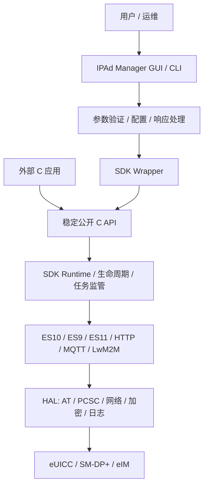

# Current-Version README Refresh Implementation Plan

> **For agentic workers:** REQUIRED SUB-SKILL: Use superpowers:subagent-driven-development (recommended) or superpowers:executing-plans to implement this plan task-by-task. Steps use checkbox (`- [ ]`) syntax for tracking.

**Goal:** Replace the obsolete, garbled root README with a verified project entry point that accurately describes the current IPAd SDK, Manager, installers, compatibility boundaries, and external integration path.

**Architecture:** Keep `README.md` as a layered overview: product installation and validation first, SDK/Manager architecture and integration second, then development and release details. Add one focused Python `unittest` contract that checks UTF-8 text, required current-version facts, retired recommendations, and repository-relative links so future changes cannot silently regress the GitHub landing page.

**Tech Stack:** GitHub Markdown, Mermaid, Python 3 standard-library `unittest`, C/CMake command examples, Ubuntu DEB, Windows/WSL2 installer documentation.

## Global Constraints

- The README serves both product users/deployment operators and SDK integration developers.
- The source of truth is current `main` code, packaging tests, installation docs, public SDK headers, and GitHub Actions—not historical promises.
- Capability labels are exactly `Available`, `Environment-dependent`, and `Not implemented`.
- Manager Profile download, enable, disable, and delete remain `Not implemented` and return `eNotImpl`.
- Ubuntu product delivery uses `ipad-manager_<version>_amd64.deb`; Windows delivery uses `IPAd-Manager-Setup-<version>-x64.exe` backed by the canonical DEB in WSL2.
- Windows requires x64, WSL2, a distribution named `Ubuntu`, and WSLg for GUI launch.
- Windows EXE signing status remains `Signed=false`; do not imply it is production-signed.
- Do not stage or modify `outputs/IPAd_SDK_Manager_Architecture_and_Usage.pptx`, `install_wsl.ps1`, or `wsl-install.log`.

---

### Task 1: Add the README currency contract

**Files:**
- Create: `packaging/tests/test_readme_current.py`
- Test: `packaging/tests/test_readme_current.py`

**Interfaces:**
- Consumes: root `README.md` and repository-relative Markdown link targets.
- Produces: `ReadmeCurrentTests`, a standalone standard-library test executable with no third-party dependencies.

- [ ] **Step 1: Write the failing test**

Create `packaging/tests/test_readme_current.py` with this implementation:

```python
import re
import unittest
from pathlib import Path
from urllib.parse import unquote


REPOSITORY_ROOT = Path(__file__).resolve().parents[2]
README = REPOSITORY_ROOT / "README.md"


class ReadmeCurrentTests(unittest.TestCase):
    @classmethod
    def setUpClass(cls):
        cls.raw = README.read_bytes()
        cls.text = cls.raw.decode("utf-8")

    def test_is_clean_utf8_without_known_mojibake(self):
        self.assertNotIn("\ufffd", self.text)
        for marker in ("馃", "鈹", "锛", "绋嬪簭"):
            self.assertNotIn(marker, self.text)

    def test_describes_current_product_delivery(self):
        required = (
            "IPAd Manager 1.1.0",
            "ipad-manager_<version>_amd64.deb",
            "IPAd-Manager-Setup-<version>-x64.exe",
            "ipad-manager-health --json",
            "ipad-manager-diagnostics",
            "WSL2",
            "WSLg",
            "Signed=false",
            "SHA256SUMS",
        )
        for value in required:
            with self.subTest(value=value):
                self.assertIn(value, self.text)

    def test_describes_sdk_contract_and_honest_capabilities(self):
        required = (
            "ipa_init_library",
            "ipa_deinit_library",
            "libipa.so",
            "Available",
            "Environment-dependent",
            "Not implemented",
            "eNotImpl",
        )
        for value in required:
            with self.subTest(value=value):
                self.assertIn(value, self.text)

    def test_does_not_recommend_legacy_product_entry_points(self):
        self.assertNotIn("一键启动", self.text)
        self.assertNotIn("./ipad_host_app", self.text)

    def test_repository_relative_links_exist(self):
        links = re.findall(r"\[[^\]]+\]\(([^)]+)\)", self.text)
        for link in links:
            target = link.strip().strip("<>").split("#", 1)[0]
            if not target or re.match(r"^(?:https?://|mailto:)", target):
                continue
            path = REPOSITORY_ROOT / unquote(target)
            with self.subTest(link=link):
                self.assertTrue(path.exists(), f"Missing README link target: {link}")


if __name__ == "__main__":
    unittest.main()
```

- [ ] **Step 2: Run the test to verify it fails against the old README**

Run:

```powershell
python packaging/tests/test_readme_current.py -v
```

Expected: FAIL in the mojibake, current product delivery, SDK contract, and legacy entry-point tests. The relative-link test may also expose obsolete targets.

- [ ] **Step 3: Commit the failing contract**

```powershell
git add -- packaging/tests/test_readme_current.py
git commit -m "test: define current README contract"
```

Expected: only `packaging/tests/test_readme_current.py` is committed.

---

### Task 2: Replace the README with the current product and SDK overview

**Files:**
- Modify: `README.md`
- Test: `packaging/tests/test_readme_current.py`
- Test: `packaging/tests/test_ci_workflow.py`

**Interfaces:**
- Consumes: capability states in `docs/installation/Capability_Matrix.md`, platform instructions in `docs/installation/Ubuntu.md` and `docs/installation/Windows.md`, lifecycle signatures in `ipa_sdk_pc/include/ipa_core.h`, query/free pairs in `ipa_sdk_pc/include/ipa.h`, Manager CLI behavior in `ipad_host_app/src/main.c`, and artifact policy in `packaging/build-release.sh`.
- Produces: a UTF-8 GitHub landing page whose internal links resolve inside the repository and whose commands use current installed binary names.

- [ ] **Step 1: Replace the title and product summary**

Replace the entire old README rather than editing garbled text in place. Start with:

```markdown
# IPAd SDK 与 IPAd Manager

IPAd SDK 是面向 Linux 的 GSMA SGP.32 IoT Profile Assistant 实现；IPAd Manager 1.1.0 在 SDK 之上提供 GTK3 图形入口、配置管理、健康检查、脱敏诊断以及 Ubuntu/Windows 统一安装体验。

> 当前仓库同时包含 SDK 源码、Manager、自动化测试和安装包构建链。安装成功表示软件与本机依赖就绪；真实 eUICC、SM-DP+、eIM、凭据和网络环境仍需项目现场验收。
```

Add badges for Ubuntu Build, Linux x86-64, Windows x64 + WSL2, C11, CMake 3.22+, and version 1.1.0. Use the workflow URL `actions/workflows/ubuntu-build.yml`; do not add a release badge for a tag that has not been verified.

- [ ] **Step 2: Add current installation and validation paths**

Add a “快速开始” section with the exact commands:

```bash
sudo apt install ./ipad-manager_<version>_amd64.deb
ipad-manager-health --json
ipad-manager-launch
```

Describe the Windows entry point as `IPAd-Manager-Setup-<version>-x64.exe`, with x64, WSL2, a distribution named `Ubuntu`, and WSLg as explicit requirements. Add:

```bash
ipad-manager-diagnostics ~/ipad-manager-diagnostics.tar.gz
```

State that diagnostics redact passwords, tokens, activation codes, confirmation codes, and key fields. Link to `docs/installation/Ubuntu.md`, `docs/installation/Windows.md`, and `docs/installation/Capability_Matrix.md`.

- [ ] **Step 3: Add the SDK/Manager architecture and call flow**

Add one Mermaid `flowchart TB` with these nodes and edges:



Explain that external callers depend on headers under `ipa_sdk_pc/include/` and `libipa.so`, while Manager isolates UI and configuration from SDK details through its wrapper layer.

- [ ] **Step 4: Add the honest capability matrix**

Use a compact table containing these rows and exact states:

| Capability | State |
|---|---|
| SDK initialization/deinitialization | Available |
| Information query entry points | Environment-dependent |
| Notifications | Available |
| Fallback and Emergency Profile | Environment-dependent |
| HTTP/MQTT/LwM2M | Environment-dependent |
| PC/SC and AT device access | Environment-dependent |
| Manager Profile download/enable/disable/delete | Not implemented (`eNotImpl`) |

Link the full matrix rather than duplicating its acceptance detail.

- [ ] **Step 5: Add the public external-call contract**

Document `ipa_init_library(cl_config_t *, ipa_event_cb_t)` as asynchronous startup whose final status arrives through the callback. Use this minimal example:

```c
#include <stdio.h>
#include "ipa_core.h"
#include "ipa.h"

static void on_ipa_event(ipa_event_type_t event, void *event_data) {
    (void)event_data;
    printf("IPA event: %d\n", event);
}

int main(void) {
    cl_config_t config = {
        .es10_driver_selected = ES10_DRIVER_AT,
        .driver_id = NULL,
        .log_level = eLogInfo,
        .initial_refresh_sleep = 1,
        .refresh_max_sleep = 64,
        .esipa_sync_package_retrieval_time = 30,
    };

    if (ipa_init_library(&config, on_ipa_event) < 0) {
        return 1;
    }

    /* Wait for IPA_EVENT_INITIALIZATION_SUCCESS before business calls. */
    char eid[33] = {0};
    ErrCode rc = ipa__get_eid_cstring(eid, sizeof(eid));
    if (rc == eOk) {
        printf("EID: %s\n", eid);
    }

    ipa_deinit_library();
    return rc == eOk ? 0 : 2;
}
```

State that production code must synchronize on the initialization callback before querying. List query/free pairs `ipa__get_certs()` / `ipa__free_certs_data()`, `ipa__get_euicc_info_1()` / `ipa__free_euicc_info1_data()`, and `ipa__get_euicc_info_2()` / `ipa__free_euicc_info2_data()`.

- [ ] **Step 6: Add Manager, compatibility, build, release, and limitations sections**

Document Manager commands:

```bash
ipad-manager --help
ipad-manager --version
ipad-manager --check-config /etc/ipad-manager/config.json
ipad-manager --config /etc/ipad-manager/config.json
```

State that GUI launch needs a desktop session or WSLg. Add the supported platforms (Ubuntu x86-64; Windows x64 through WSL2/Ubuntu/WSLg), private library location behavior (no `LD_LIBRARY_PATH` required after package installation), and configuration preservation during upgrade/removal.

Add source-build commands matching CI:

```bash
cmake -S ipa_sdk_pc -B ipa_sdk_pc/build -DCMAKE_BUILD_TYPE=Release
cmake --build ipa_sdk_pc/build --parallel
ctest --test-dir ipa_sdk_pc/build --output-on-failure
```

Explain that `packaging/build-release.sh` gates tests and creates the DEB, Windows EXE, `BUILD_METADATA.txt`, `DEPENDENCIES.lock.txt`, `health.json`, `install-manifest.json`, `release.json`, and `SHA256SUMS`. State `Signed=false` for the current EXE and require organizational code signing before commercial external distribution.

End with internal links to:

- `docs/installation/Ubuntu.md`
- `docs/installation/Windows.md`
- `docs/installation/Capability_Matrix.md`
- `ipad_host_app/docs/API_Reference.md`
- `ipad_host_app/docs/Architecture_Design.md`
- `ipad_host_app/docs/CONFIG_GUIDE.md`
- `PROJECT_STRUCTURE.md`

- [ ] **Step 7: Run focused tests and Markdown checks**

Run:

```powershell
python packaging/tests/test_readme_current.py -v
python packaging/tests/test_ci_workflow.py -v
git diff --check
```

Expected: 5 README tests pass, 3 CI workflow tests pass, and `git diff --check` prints no errors.

- [ ] **Step 8: Review the rendered structure and commit**

Verify that headings form one logical hierarchy, Mermaid uses valid node identifiers, code fences are balanced, and capability labels match the source matrix. Then run:

```powershell
git add -- README.md
git commit -m "docs: refresh README for current IPAd release"
```

Expected: only `README.md` is included in this commit; user-owned unrelated files remain unstaged.

---

### Task 3: Final verification and GitHub publication

**Files:**
- Verify: `README.md`
- Verify: `packaging/tests/test_readme_current.py`
- Verify: `.github/workflows/ubuntu-build.yml`

**Interfaces:**
- Consumes: the two commits from Tasks 1 and 2.
- Produces: a synchronized `main` branch and a successful GitHub `Ubuntu Build` run for the README head commit.

- [ ] **Step 1: Run the complete documentation gate from a clean index**

```powershell
python packaging/tests/test_readme_current.py -v
python packaging/tests/test_ci_workflow.py -v
git diff --check HEAD~2..HEAD
git status --short
```

Expected: 8 tests pass; diff check is clean; only the pre-existing PPT deletion and WSL files remain outside the two intended commits.

- [ ] **Step 2: Push `main` and monitor GitHub Actions**

```powershell
git push origin main
```

Poll the GitHub Actions API for the run whose `head_sha` equals the new local `HEAD`. Expected final state: `status=completed`, `conclusion=success`.

- [ ] **Step 3: Report evidence**

Report both commit hashes, the successful Actions URL, test counts, and the fact that unrelated local files were preserved.
